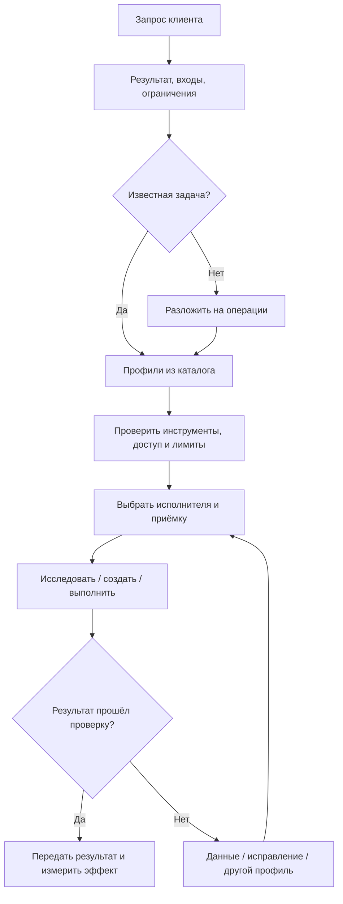

# Карта задач агентства

Версия 0.6. [Структура проекта и процессы](agency-project.md). Хранение и инструменты: [контракт](agency-storage.md). Поручения: [практики](prompting-guide.md). Дипресерч RESEARCH-01 и большой корпус RESEARCH-04 используют Sol Medium на синтезе; точные overrides в JSON и странице. Каталог охватывает 16 направлений и 128 типовых задач агентства. Это проектная декомпозиция, а не список 128 доказанных побед моделей. Обзор практики и ограничения источников — в [исследовании](agency-research.md). Короткие правила выбора, баланс подписок и подключения — в [роутере](model-router.md).

## Как читать карту

Найди задачу поиском по названию или ID. Столбец «Маршрут» задаёт последовательность операций; коды раскрыты ниже. Соседние совместимые этапы выполняет один агент. Не создавай отдельного помощника на каждую стрелку. «Приёмка» строки дополняет общую проверку профиля. Инструменты направления — необходимые категории возможностей, а не подтверждение установленных интеграций.

Первые четыре задачи каждого направления помечены в JSON как `core`: это приоритет внедрения для данного агентства, выбранный по запросу и полезности. Остальные — `extended`. Это не измеренная частота применения на рынке. Источники подтверждают общие классы работ; конкретная детализация и назначения моделей являются рекомендацией.

## Профили исполнения

Назначения — стартовые гипотезы по [предыдущему аудиту](audit.md), возможностям подключений и характеру операции. Reddit и маркетинговые опросы не сравнивают эти точные версии и effort. «Рецензент» — кандидат для важной независимой проверки; обычную приёмку инструментами исполнитель проводит сам. Если рецензент оказался автором после fallback, выбрать другое семейство с нужными инструментами.

| Код / операция | Старт | Резерв | Рецензент для важной задачи |
|---|---|---|---|
| **PLAN** — Стратегия и проектирование | Sol Medium | Fable 5.1 Low | Astra Low |
| **RESEARCH** — Поиск и доказательное исследование | Terra Medium | Sol Medium | Gemini 3.8 Flash Medium |
| **DATA** — Извлечение и классификация | Luna High Fast | Gemini 3.8 Flash Medium | Terra Medium |
| **TEXT** — Смысл, текст и редактура | Opus 5 Low | Terra Medium | Gemini 3.8 Flash Medium |
| **IDEA** — Варианты и гипотезы | Gemini 3.8 Flash Low | Opus 5 Low | Terra Medium |
| **CODE** — Код и автоматизация | Grok 4.6 High | Terra Medium | Opus 5 Medium |
| **MEASURE** — Расчёты и диагностика | Sol Medium | Terra Medium | Gemini 3.8 Flash Medium |
| **VISUAL** — Визуальный разбор и контроль | Gemini 3.8 Flash Medium | Terra Medium | Opus 5 Low |
| **FORMAT** — Форматирование и упаковка | Luna High Fast | Gemini 3.8 Flash Medium | Terra Medium |
| **CHECK** — Проверка по рубрике | Gemini 3.8 Flash Medium | Luna High Fast | Terra Medium |
| **OPERATE** — Действия в рабочих системах | Terra Medium | Sol Medium | Gemini 3.8 Flash Medium |

**Luna — только High Fast / Max Fast.** Fast недоступен → другой подходящий исполнитель. У Gemini перед использованием необходимо проверить Antigravity: каталог есть, работоспособность запуска не подтверждена. VISUAL требует реальной передачи изображения, OPERATE — подключения целевого сервиса; название модели само по себе доступа не даёт. Создание изображений, видео, макетов и экспорт выполняет соответствующий инструмент.

- **PLAN:** Требования → решения → ограничения → критерии; допущения отделены от фактов. Усиление: Неопределённость: сначала получить недостающие ограничения; трудное противоречие → Astra High.
- **RESEARCH:** Реестр утверждений, даты, первоисточники, контрсвидетельства и непрочитанные источники. Усиление: Дипресерч → Sol Medium; трудное противоречие → Astra Low, затем Medium/High по провалу приёмки. Нет поиска → сменить инструмент/агента.
- **DATA:** Схема, ID источников, покрытие корпуса, пропуски и неоднозначные элементы; контрольная выборка. Усиление: Спорный смысл → Opus Medium; сложная массовая обработка → скрипт CODE и проверка DATA.
- **TEXT:** Факты, обещания, тон бренда, задача читателя и сохранение исходного смысла. Усиление: Противоречивый материал → Opus High; спорные факты → RESEARCH.
- **IDEA:** Различимые варианты по заданным осям; гипотезы не выдаются за исследования или отзывы. Усиление: Нет полезного разнообразия → Opus Medium с новыми ограничениями.
- **CODE:** Воспроизводимый сценарий, нужные тесты, diff и отсутствие поломок за пределами задачи. Усиление: Две неудачи одной причины → Sol Medium, затем Astra Low/High по сложности; архитектура и рефакторинг → PLAN.
- **MEASURE:** Числа рассчитаны кодом/формулами; единицы, периоды, знаменатели и альтернативные причины проверены. Усиление: Нет данных → сбор; причинность не устанавливать по одной корреляции; спор → независимый расчёт.
- **VISUAL:** Скриншот/кадр, координаты или таймкод, конкретный дефект; просмотр экспортированного результата. Усиление: Нет передачи изображения → агент с image_input; сложный UX → PLAN, исправление → CODE или медиатул.
- **FORMAT:** Сохранены значения и смысл, корректен формат, открывается экспорт, нет потери строк. Усиление: Luna Max Fast; если Fast недоступен → Gemini Medium с теми же инструментами.
- **CHECK:** Дефект → доказательство → влияние → исправление; учитывать ложные тревоги. Усиление: Код → Opus Medium; сложные противоречия/метрики → Astra High; автор себя независимо не проверяет.
- **OPERATE:** Проверены объект, изменение и состояние после действия; зафиксирован ID/URL результата. Усиление: Проблема доступа → восстановление подключения; действие за пределами поручения не исполнять.

## Навигация

- [BRIEF · Бриф, аккаунтинг и управление проектом](#brief)
- [RESEARCH · Исследования рынка, аудитории и текста](#research)
- [STRATEGY · Маркетинговая и продуктовая стратегия](#strategy)
- [SEO · SEO, структура сайта и поисковая видимость](#seo)
- [CONTENT · Копирайтинг, редактура и контент](#content)
- [ADS · Контекстная, таргетированная реклама и медиабаинг](#ads)
- [DESIGN · Бренд-дизайн, UX/UI и графика](#design)
- [WEB · Сайты, CMS и интернет-магазины](#web)
- [SOFTWARE · Программы, скрипты, боты и интеграции](#software)
- [ANALYTICS · Аналитика, измерения и CRO](#analytics)
- [SOCIAL · Соцсети, комьюнити и репутация](#social)
- [VIDEO · Видео, аудио, Reels и подкасты](#video)
- [CRM · CRM, email и удержание](#crm)
- [COMMERCE · Каталоги, маркетплейсы и коммерческий контент](#commerce)
- [OPS · Внутренние процессы и автоматизация агентства](#ops)
- [CARE · Качество, сопровождение и нестандартные задачи](#care)

## BRIEF

### Бриф, аккаунтинг и управление проектом

Метод: Преобразовать запрос в результат, ограничения, зависимости и договорённости.

Инструменты: документы клиента, Tasks/CRM, транскрипция. Основания класса задач: [S1](agency-research.md#s1), [R1](agency-research.md#r1).

| ID | Задача | Маршрут | Результат | Приёмка |
|---|---|---|---|---|
| BRIEF-01 | Разобрать входящий запрос и определить услугу | DATA → PLAN | Карточка задачи с целями и недостающими входами | Не додуманы бюджет, сроки и доступы; есть ответственный |
| BRIEF-02 | Бриф и список вопросов клиенту | TEXT | Бриф по неизвестным, влияющим на решение | Нет вопросов, на которые уже есть ответ в материалах |
| BRIEF-03 | Созвон → решения и задачи | DATA → FORMAT | Протокол, поручения, сроки, нерешённые вопросы | Каждое решение привязано к фрагменту; неизвестный срок не выдуман |
| BRIEF-04 | Декомпозиция проекта и зависимости | PLAN | Этапы, владельцы, входы и критерии завершения | Каждый результат имеет принимающего; зависимости не образуют цикл |
| BRIEF-05 | Оценка объёма и коммерческое предложение | PLAN → MEASURE → TEXT | Состав работ, диапазон оценки, допущения | Часы и суммы сходятся; исключения и исходные ставки видны |
| BRIEF-06 | Изменения требований и влияние на сроки | DATA → PLAN | Сравнение версий и последствия изменения | Старые требования не потеряны; новое отделено от согласованного |
| BRIEF-07 | Еженедельный статус клиенту | DATA → TEXT | Сделано, результаты, проблемы, следующие действия | Статус подтверждён артефактами; текст подготовлен к отправке |
| BRIEF-08 | Передача проекта и инструкция клиенту | DATA → TEXT → FORMAT | Пакет доступов по ссылкам, инструкций и приёмки | Нет секретов в отчёте; получатель может повторить основной сценарий |

## RESEARCH

### Исследования рынка, аудитории и текста

Метод: Вопрос → источники → извлечение → проверка → синтез. Для интервью: кодирование с примерами, отрицательными случаями и разделением наблюдения/вывода.

Инструменты: поиск и браузер, корпус с ID, таблицы. Основания класса задач: [S1](agency-research.md#s1), [R1](agency-research.md#r1), [S3](agency-research.md#s3).

| ID | Задача | Маршрут | Результат | Приёмка |
|---|---|---|---|---|
| RESEARCH-01 | Дипресерч рынка или темы | RESEARCH → DATA → TEXT → CHECK | Досье, таблица утверждений, выводы и неизвестное | Важные утверждения подтверждены; противоречия объяснены |
| RESEARCH-02 | Конкуренты, офферы и посадочные | RESEARCH → DATA → PLAN | Сравнительная матрица и возможности | У каждого признака URL и дата; отсутствие сведений не равно отсутствию функции |
| RESEARCH-03 | Отзывы, комментарии и интервью | DATA → TEXT | Кодировочная схема, боли, возражения, цитаты | Вывод связан с ID; частоты относятся только к исследованному корпусу |
| RESEARCH-04 | Анализ большого текстового корпуса | DATA → TEXT → CHECK | Темы, структура аргументов, противоречия | Сохранены отрицания, исключения и поздние поправки; есть учёт всех частей |
| RESEARCH-05 | JTBD и сегменты аудитории | DATA → PLAN | Сегменты по ситуациям и работам клиента | Гипотезы отделены от наблюдений; нет выдуманных интервью |
| RESEARCH-06 | План опроса или пользовательского интервью | PLAN → TEXT | Вопросы, выборка, критерии набора | Вопросы не подсказывают ответ; результаты ещё не симулированы |
| RESEARCH-07 | Фактчекинг и поиск контрсвидетельств | RESEARCH → CHECK | Утверждение → статус → источник | Проверено содержание источника, не только заголовок и поисковый сниппет |
| RESEARCH-08 | Мониторинг рынка и изменений конкурентов | OPERATE → DATA → TEXT | Изменения относительно датированного снимка | Есть предыдущий снимок; новое отделено от повторов и смены вёрстки |

## STRATEGY

### Маркетинговая и продуктовая стратегия

Метод: Диагноз → варианты → критерии выбора → проверяемые гипотезы. Использовать STP/JTBD, путь клиента и матрицу сообщений по необходимости.

Инструменты: данные бизнеса, исследования, таблицы. Основания класса задач: [S1](agency-research.md#s1).

| ID | Задача | Маршрут | Результат | Приёмка |
|---|---|---|---|---|
| STRATEGY-01 | Позиционирование и УТП | PLAN → TEXT | Позиционирование с доказательствами | Отличия опираются на продукт и рынок; нет пустых превосходных степеней |
| STRATEGY-02 | Оффер и сообщения по сегментам | PLAN → TEXT | Сегмент → проблема → обещание → доказательство | Обещания выполнимы и соответствуют конкретному сегменту |
| STRATEGY-03 | Воронка и путь клиента | PLAN | Карта шагов, потерь и гипотез | Для каждого перехода определены событие и способ измерения |
| STRATEGY-04 | Маркетинговый план и выбор каналов | PLAN → MEASURE | Приоритеты, бюджетные сценарии и KPI | Допущения явны; план связан с ресурсами и данными |
| STRATEGY-05 | Запуск продукта или услуги | PLAN → TEXT | План запуска, зависимости, материалы | Есть критерии готовности и измеримый следующий этап |
| STRATEGY-06 | Исследование цены и пакетов | RESEARCH → MEASURE → PLAN | Сценарии упаковки и проверка спроса | Не придумана готовность платить; экономика посчитана отдельно |
| STRATEGY-07 | План экспериментов ICE/RICE | PLAN → MEASURE | Реестр гипотез с обоснованием приоритетов | Оценки помечены как оценки; одна метрика успеха на эксперимент |
| STRATEGY-08 | Стратегическая сессия и проверка предположений | PLAN → CHECK | Альтернативы, возражения, решения | Критик ищет провал допущений, а не формальное несогласие |

## SEO

### SEO, структура сайта и поисковая видимость

Метод: Реальные запросы и SERP → интенты → страницы → полезный контент → техническая проверка → измерение. GEO/AEO проверять отдельно от обещаний продвижения.

Инструменты: Search Console/Вебмастер, краулер, SERP, Wordstat/keyword data. Основания класса задач: [R3](agency-research.md#r3), [S4](agency-research.md#s4), [S5](agency-research.md#s5).

| ID | Задача | Маршрут | Результат | Приёмка |
|---|---|---|---|---|
| SEO-01 | Сбор семантики и интентов | RESEARCH → DATA | Семантическое ядро с источниками метрик | Частотность и позиции не сгенерированы моделью; указан регион |
| SEO-02 | Кластеризация и карта страниц | DATA → PLAN | Запрос → интент → целевая страница | Пограничные кластеры сверены с выдачей; нет необоснованных дублей |
| SEO-03 | Технический SEO-аудит | OPERATE → DATA → MEASURE | Ошибки с URL, влиянием и очередью исправлений | Есть crawl-данные и воспроизводимые примеры; выводы не по одной главной странице |
| SEO-04 | Контент-бриф и внутренняя перелинковка | PLAN → TEXT → CHECK | Бриф, сущности, разделы, ссылки | Каждая страница решает свою задачу; ссылки существуют и полезны |
| SEO-05 | Title, description и массовые метаданные | TEXT → FORMAT → CHECK | Таблица URL и метаданных | Нет дубликатов и ложных обещаний; длины проверены кодом |
| SEO-06 | Миграция, canonical, redirects, sitemap, schema | PLAN → CODE → CHECK | Карта миграции и технические изменения | Проверены статусы, цепочки, индексация и соответствие разметки видимому содержимому |
| SEO-07 | Локальное SEO и карточки организаций | DATA → TEXT → OPERATE | Актуальные данные, описания, ответы | Название, адрес, часы и услуги сверены; публикация в пределах поручения |
| SEO-08 | Диагностика трафика и AI-видимости | MEASURE → RESEARCH → PLAN | Изменения по страницам/запросам и план проверки | Учтены сезонность и измерение; нет гарантии цитирования или специальной чудо-разметки |

## CONTENT

### Копирайтинг, редактура и контент

Метод: Задача читателя → проверенный материал → структура → текст → редактура по рубрике.

Инструменты: бренд-гайд, исходные факты, CMS/редактор. Основания класса задач: [S1](agency-research.md#s1), [R1](agency-research.md#r1), [S4](agency-research.md#s4).

| ID | Задача | Маршрут | Результат | Приёмка |
|---|---|---|---|---|
| CONTENT-01 | Текст лендинга или страницы услуги | TEXT → CHECK | Оффер, блоки, CTA и доказательства | Читателю понятно предложение; нет придуманных кейсов и гарантий |
| CONTENT-02 | Статья, руководство или экспертный материал | RESEARCH → PLAN → TEXT → CHECK | Текст с источниками и иллюстративным планом | Раскрыта задача читателя; источники подтверждают факты; нет механического пересказа выдачи |
| CONTENT-03 | Редактура и голос бренда | TEXT → CHECK | Исправленный текст и существенные изменения | Смысл и обязательные условия сохранены; тон соответствует примерам |
| CONTENT-04 | Контент-план и рубрикатор | DATA → PLAN → FORMAT | Темы, аудитории, форматы, этап воронки | Темы обоснованы спросом/стратегией; нет дублей одного интента |
| CONTENT-05 | Кейс, white paper или лид-магнит | DATA → TEXT → FORMAT | Материал с результатами и условиями | Числа сверены; причинность и вклад агентства не преувеличены |
| CONTENT-06 | UX-тексты и сообщения интерфейса | TEXT → CHECK | Подписи, ошибки, пустые состояния | Текст помогает следующему действию; ограничения интерфейса соблюдены |
| CONTENT-07 | Локализация и адаптация под рынок | RESEARCH → TEXT → CHECK | Локализованный текст и глоссарий | Сохранены факты, валюта и смысл; региональные детали проверены |
| CONTENT-08 | Обновление старого контента | RESEARCH → DATA → TEXT | Изменения и обновлённый материал | Устаревшие факты заменены по источникам; дата не обновлена формально |

## ADS

### Контекстная, таргетированная реклама и медиабаинг

Метод: Бизнес-цель → структура → варианты → контроль ограничений → запуск → измерение. Расчёты выполняются вне языковой модели.

Инструменты: Google Ads/Яндекс Директ/Meta, выгрузки, скрипты/API. Основания класса задач: [R2](agency-research.md#r2), [S1](agency-research.md#s1), [S6](agency-research.md#s6).

| ID | Задача | Маршрут | Результат | Приёмка |
|---|---|---|---|---|
| ADS-01 | Аудит рекламного кабинета | DATA → MEASURE → PLAN | Проблемы, доказательства, приоритеты | Период, валюта и конверсии согласованы; рекомендации учитывают объём данных |
| ADS-02 | Поисковые запросы и минус-слова | DATA → CHECK | Кандидаты исключений с причиной | Проверены полезные запросы, пересечения и типы соответствия |
| ADS-03 | Структура кампаний и групп | PLAN → DATA | Структура по интентам и посадочным | Нет потерянных сегментов; таргетинги согласованы с оффером |
| ADS-04 | Объявления и матрица креативов | IDEA → TEXT → CHECK | Варианты по гипотезам для каждой площадки | Лимиты проверены программно по текущим спецификациям; факты верны |
| ADS-05 | Бюджет, pacing и аномалии | MEASURE → CODE | Расчёт, правила и уведомления | Есть пределы и проверка на исторических данных; прогноз не выдан за факт |
| ADS-06 | Товарный фид и рекламный каталог | DATA → CODE → CHECK | Исправления полей и отчёт ошибок | Цены и наличие из первичной системы; валидность и покрытие SKU проверены |
| ADS-07 | Подготовка и запуск кампании | FORMAT → CHECK → OPERATE | Пакет импорта и опубликованные объекты при порученном запуске | Кабинет, география, бюджет, даты и URL проверены до и после действия |
| ADS-08 | Разбор креативов и план следующего теста | MEASURE → VISUAL → PLAN | Результаты по гипотезам и следующий тест | Не спутаны эффект аудитории, плейсмента и самого креатива |

## DESIGN

### Бренд-дизайн, UX/UI и графика

Метод: Исследование → концепция → прототип/макет → визуальная и функциональная проверка → экспорт. LLM выбирает и описывает, графические инструменты создают артефакт.

Инструменты: Figma/Canva при подключении, генерация изображений, скриншоты. Основания класса задач: [S2](agency-research.md#s2), [R4](agency-research.md#r4).

| ID | Задача | Маршрут | Результат | Приёмка |
|---|---|---|---|---|
| DESIGN-01 | Дизайн-бриф и направление | PLAN → IDEA | Концепции с ограничениями и референсами | Связь с брендом и задачей; варианты отличаются идеей, не только цветом |
| DESIGN-02 | Информационная архитектура и wireframe | PLAN → CODE → VISUAL | Структура экранов и кликабельный прототип | Проходит ключевой сценарий; учтены ошибки, пустые и загрузочные состояния |
| DESIGN-03 | UI-макет и дизайн-система | PLAN → OPERATE → VISUAL | Компоненты, состояния, токены и макеты | Согласованы сетка, типографика, компоненты и адаптивность |
| DESIGN-04 | Баннеры и адаптация размеров | IDEA → OPERATE → VISUAL | Серия креативов по шаблону | Нет обрезки текста/объектов; экспорт соответствует площадке |
| DESIGN-05 | Генерация и редактирование изображений | TEXT → OPERATE → VISUAL | Промпт, изображение и финальный экспорт | Реально вызван медиатул; результат соответствует брифу и проверен глазами |
| DESIGN-06 | Презентация и коммерческий дизайн | PLAN → TEXT → OPERATE → VISUAL | Редактируемый файл и экспорт | Каждый слайд решает задачу; числа и читаемость проверены |
| DESIGN-07 | Визуальный аудит и доступность | VISUAL → CHECK | Дефекты с примерами и приоритетом | Автоматические проверки дополнены просмотром; не заявлено полное соответствие по скриншоту |
| DESIGN-08 | Передача в разработку или печать | DATA → FORMAT → VISUAL | Исходники, спецификации, ассеты | Форматы, размеры, шрифты и требования получателя проверены |

## WEB

### Сайты, CMS и интернет-магазины

Метод: Требования → пользовательский сценарий → реализация → проверка в браузере → выпуск и наблюдение.

Инструменты: репозиторий/CMS, браузер, test runner. Основания класса задач: [R5](agency-research.md#r5), [S7](agency-research.md#s7).

| ID | Задача | Маршрут | Результат | Приёмка |
|---|---|---|---|---|
| WEB-01 | Лендинг по готовому брифу | CODE → VISUAL → CHECK | Рабочая страница и проверка заявки | Адаптивность, формы и основные состояния работают |
| WEB-02 | Корпоративный сайт и шаблоны страниц | PLAN → CODE → CHECK | Сайт и переиспользуемые шаблоны | Навигация, содержимое, SEO-поля и редактирование проверены |
| WEB-03 | CMS, WordPress и контентные модели | PLAN → CODE → CHECK | Модели данных и редакторские сценарии | Редактор может обновить контент; обновления не ломают шаблон |
| WEB-04 | Формы, CRM, оплата и бронирование | PLAN → CODE → CHECK | Рабочая интеграция | Проверены ошибки, повторная отправка и тестовая транзакция где применимо |
| WEB-05 | Магазин, фильтры, поиск, корзина | PLAN → CODE → CHECK | Каталог и сценарий заказа | Проверены варианты товара, наличие, пустой поиск и итоговая стоимость |
| WEB-06 | Производительность и Core Web Vitals | MEASURE → CODE → CHECK | Измерения и исправления | Сравнимые условия до/после; лабораторные метрики отделены от полевых |
| WEB-07 | Мультиязычность и перенос сайта | PLAN → CODE → CHECK | Локали, перенос данных, redirects | Нет потери URL/контента; ссылки и выбор языка проверены |
| WEB-08 | Публикация и поддержка сайта | OPERATE → CHECK | Релиз, проверка сценария, способ восстановления | Зафиксированы версия и рабочий URL; сайт проверен после выпуска |

## SOFTWARE

### Программы, скрипты, боты и интеграции

Метод: Контракт → маленькие проверяемые изменения → тест исходного сценария → документирование.

Инструменты: репозиторий, API-документация, runtime и тесты. Основания класса задач: [R5](agency-research.md#r5), [S7](agency-research.md#s7), [R2](agency-research.md#r2).

| ID | Задача | Маршрут | Результат | Приёмка |
|---|---|---|---|---|
| SOFTWARE-01 | Скрипт обработки файлов или отчётов | CODE → CHECK | Скрипт, пример запуска, выходные файлы | Работает на пустом/битом входе; нет неожиданной перезаписи |
| SOFTWARE-02 | API-интеграция и webhook | PLAN → CODE → CHECK | Интеграция с обработкой ошибок | Проверены повторы, тайм-ауты и идемпотентность |
| SOFTWARE-03 | Telegram-бот или внутренний помощник | PLAN → CODE → CHECK | Бот и сценарии взаимодействия | Права, состояние диалога и отказ внешнего сервиса проверены |
| SOFTWARE-04 | Багфикс и регрессия | CODE → CHECK | Исправление и проверка воспроизведения | Исходный баг воспроизведён и устранён без маскировки |
| SOFTWARE-05 | Архитектура и сложный рефакторинг | PLAN → CODE → CHECK | Решение, изменение и проверка совместимости | Старые контракты сохранены либо миграция описана |
| SOFTWARE-06 | Сложная ошибка, гонки, потеря данных | MEASURE → CODE → CHECK | Диагноз с воспроизведением и исправление | Причина подтверждена; проверены повторные/конкурентные события |
| SOFTWARE-07 | Парсер и загрузчик данных | RESEARCH → CODE → DATA | Данные, схема, журнал ошибок | Есть источник, дата, пагинация, дедупликация и учёт недоступных элементов |
| SOFTWARE-08 | Внутренний инструмент или AI-помощник | PLAN → CODE → CHECK | Приложение и набор оценочных примеров | Проверены качество ответов, tool calls, ограничения доступа и сценарий отказа |

## ANALYTICS

### Аналитика, измерения и CRO

Метод: Вопрос → определение метрик → проверка данных → расчёт → интерпретация → эксперимент.

Инструменты: GA4/Метрика, GTM, SQL/таблицы, CRM. Основания класса задач: [S1](agency-research.md#s1), [R2](agency-research.md#r2), [S6](agency-research.md#s6).

| ID | Задача | Маршрут | Результат | Приёмка |
|---|---|---|---|---|
| ANALYTICS-01 | План событий и измерения конверсий | PLAN → CODE → CHECK | События, параметры, настройка и тест | Одно действие не удваивает конверсию; тестовые события видны |
| ANALYTICS-02 | Дашборд и отчёт клиенту | CODE → MEASURE → TEXT | Таблицы, графики и выводы | Все итоги воспроизводимы; периоды и фильтры указаны |
| ANALYTICS-03 | Анализ воронки и качества лидов | MEASURE → PLAN | Потери по шагам и план проверки | Есть связь с CRM; лиды не спутаны с продажами |
| ANALYTICS-04 | Аудит посадочной и гипотезы CRO | VISUAL → MEASURE → PLAN | Гипотезы с подтверждением | Наблюдение отделено от причины; улучшение проверяется экспериментом |
| ANALYTICS-05 | A/B-тест и интерпретация результата | PLAN → CODE → MEASURE | Дизайн теста, расчёт и решение | Единица рандомизации, объём, срок и правило остановки заданы заранее |
| ANALYTICS-06 | Атрибуция, экономика и бюджетные сценарии | MEASURE → PLAN | Расчёт CPA/ROAS и сценарии | Не смешаны атрибуционные модели, выручка и прибыль; неизвестные расходы отмечены |
| ANALYTICS-07 | Аномалии, просадки и диагностика трекинга | MEASURE → CODE → CHECK | Дерево причин и подтверждённые дефекты | Сбой измерения отделён от изменения бизнеса |
| ANALYTICS-08 | Когорты, удержание и LTV | CODE → MEASURE | Когортные таблицы и выводы | Учтены неполные когорты, возвраты и горизонт; модельный LTV помечен |

## SOCIAL

### Соцсети, комьюнити и репутация

Метод: Наблюдение → рубрики → адаптация → публикация → обратная связь. Реальный корпус комментариев важнее синтетических персон.

Инструменты: социальный браузер/API, планировщик, корпус публикаций. Основания класса задач: [R6](agency-research.md#r6), [S1](agency-research.md#s1), [R1](agency-research.md#r1).

| ID | Задача | Маршрут | Результат | Приёмка |
|---|---|---|---|---|
| SOCIAL-01 | Социальное слушание и обсуждения | RESEARCH → DATA → TEXT | Темы, формулировки и сигналы аудитории | Есть ссылки на обсуждения; выборка и ограничения раскрыты |
| SOCIAL-02 | Контент-календарь соцсетей | PLAN → IDEA → FORMAT | Рубрики, даты, цели и форматы | Есть ресурсы производства и связь с задачами бизнеса |
| SOCIAL-03 | Посты, карусели и адаптация каналов | TEXT → OPERATE → VISUAL | Тексты и готовые материалы | Смысл сохранён; формат и тон адаптированы под канал |
| SOCIAL-04 | Переработка статьи/видео в несколько форматов | DATA → TEXT → FORMAT | Пакет постов, тезисов и сценариев | Каждый формат самодостаточен; факты не исказились при сокращении |
| SOCIAL-05 | Ответы на комментарии и модерация | DATA → TEXT | Классификация и черновики ответов | Контекст учтён; спорные случаи выделены; отправка требует поручения на ответы |
| SOCIAL-06 | Планирование и публикация | CHECK → OPERATE | Записи в календаре и URL публикаций | Аккаунт, время, вложения и ссылки проверены; нет дублей |
| SOCIAL-07 | Инфлюенсеры и партнёрские интеграции | RESEARCH → DATA → PLAN | Шорт-лист, соответствие, бриф | Показатели взяты из источников; аудитория не объявлена подлинной без проверки |
| SOCIAL-08 | Репутационный инцидент и разбор реакции | RESEARCH → PLAN → TEXT | Хронология, позиции, черновик ответа | Факты отделены от обвинений; публичные заявления в рамках полномочий |

## VIDEO

### Видео, аудио, Reels и подкасты

Метод: Исходник → транскрипция → отбор → монтаж → субтитры → экспорт → просмотр.

Инструменты: ASR, ffmpeg/монтажный инструмент, просмотр кадров и звука. Основания класса задач: [R6](agency-research.md#r6), [S2](agency-research.md#s2).

| ID | Задача | Маршрут | Результат | Приёмка |
|---|---|---|---|---|
| VIDEO-01 | Транскрибация и разметка спикеров | OPERATE → DATA → CHECK | Транскрипт с таймкодами | Неясные слова отмечены; важные цитаты сверены со звуком |
| VIDEO-02 | Отбор фрагментов для Reels/Shorts | DATA → TEXT → VISUAL | Фрагменты с таймкодами и обоснованием | Смысл самодостаточен; начало/конец и контекст проверены |
| VIDEO-03 | Сценарий ролика и раскадровка | PLAN → TEXT → VISUAL | Сценарий, кадры, реплики, CTA | Реализуемо по длительности и ресурсам; нет выдуманной демонстрации |
| VIDEO-04 | Монтаж, кадрирование и субтитры | OPERATE → VISUAL → CHECK | Готовое видео и проект где доступен | Нет обрезанных лиц/текста; звук, синхронизация и финальный файл проверены |
| VIDEO-05 | Обложка, заголовок и описание | IDEA → TEXT → OPERATE → VISUAL | Обложка и метаданные | Соответствуют содержанию; читаемость на малом размере проверена |
| VIDEO-06 | Очистка звука и локализация видео | OPERATE → DATA → CHECK | Аудио, субтитры или дубляж | Термины и имена сверены; нет потери фраз и рассинхронизации |
| VIDEO-07 | Подкаст → статья, таймкоды, show notes | DATA → TEXT → FORMAT | Сопроводительный пакет | Таймкоды кликабельны где нужно; цитаты и имена точны |
| VIDEO-08 | Видеоаналитика и гипотезы удержания | MEASURE → VISUAL → PLAN | Провалы удержания и монтажные гипотезы | Метрики получены с платформы; малый объём просмотров учтён |

## CRM

### CRM, email и удержание

Метод: События клиента → сегменты → сообщения → автоматизация → контроль результата. Правила и расчёты исполняет система.

Инструменты: CRM/ESP, таблицы, API, шаблоны писем. Основания класса задач: [R7](agency-research.md#r7), [R8](agency-research.md#r8), [S1](agency-research.md#s1).

| ID | Задача | Маршрут | Результат | Приёмка |
|---|---|---|---|---|
| CRM-01 | Очистка и нормализация CRM | DATA → CODE → CHECK | Дубликаты, нормализованные поля, журнал | Есть правила слияния и контроль потери записей |
| CRM-02 | Сегментация и квалификация лидов | DATA → PLAN → CHECK | Сегменты и объяснимые правила | Решения опираются на реальные поля; пограничные случаи выделены |
| CRM-03 | Цепочки welcome, nurturing, reactivation | PLAN → TEXT → CHECK | Схема и тексты писем | Триггеры, исключения и завершение цепочки определены |
| CRM-04 | Темы писем и варианты для теста | IDEA → TEXT → CHECK | Варианты с гипотезами | Различия значимы; обещание соответствует содержанию |
| CRM-05 | Email-шаблон и динамический контент | CODE → VISUAL → CHECK | HTML/шаблон и предпросмотры | Рендер проверен; переменные имеют запасные значения |
| CRM-06 | Настройка автоматических сценариев | PLAN → CODE → OPERATE → CHECK | Рабочие потоки и журнал проверок | Нет зацикливания и повторных отправок; тестовые контакты проходят сценарий |
| CRM-07 | Классификация входящих ответов | DATA → CHECK | Интерес, отказ, отписка, автоответ, неизвестно | Отрицание и цитируемая переписка не спутаны с новым ответом |
| CRM-08 | Доставляемость и результат рассылок | MEASURE → RESEARCH → PLAN | Диагностика и план теста | Открытия не приравнены к чтению; использованы реальные события ESP |

## COMMERCE

### Каталоги, маркетплейсы и коммерческий контент

Метод: Источник товара → нормализация → содержание → фид → публикация → измерение.

Инструменты: PIM/каталог, таблицы, CMS/маркетплейс, изображения. Основания класса задач: [R2](agency-research.md#r2), [S1](agency-research.md#s1).

| ID | Задача | Маршрут | Результат | Приёмка |
|---|---|---|---|---|
| COMMERCE-01 | Массовые карточки товаров | DATA → TEXT → CHECK | Описания и характеристики | Ни одна характеристика не выдумана; единицы и варианты сохранены |
| COMMERCE-02 | Категории, фильтры и атрибуты | DATA → PLAN | Таксономия и правила маппинга | Все товары размещены; дубли и противоречивые атрибуты выделены |
| COMMERCE-03 | Фиды и синхронизация цен/остатков | CODE → CHECK | Обновляемый фид и журнал | Источник цены един; обновление повторяемо и не теряет товары |
| COMMERCE-04 | Анализ отзывов и вопросов по товарам | DATA → TEXT | Проблемы, вопросы и идеи улучшения карточек | Есть ID отзывов; жалобы не обобщены на весь ассортимент |
| COMMERCE-05 | Предметные изображения и инфографика | TEXT → OPERATE → VISUAL | Визуалы карточки | Внешний вид и свойства товара не искажены |
| COMMERCE-06 | Сравнения, комплекты и рекомендации | DATA → PLAN → TEXT | Правила и сравнительные материалы | Совместимость подтверждена данными; нет ложных преимуществ |
| COMMERCE-07 | Мониторинг цен и ассортимента конкурентов | RESEARCH → CODE → DATA | Датированные сопоставления | Сравниваются одинаковые SKU/условия, а не похожие названия |
| COMMERCE-08 | Анализ SKU и коммерческих потерь | MEASURE → PLAN | Приоритеты по товарам | Учтены маржа, остатки, возвраты и период; нет вывода по одному клику |

## OPS

### Внутренние процессы и автоматизация агентства

Метод: Процесс → контракт данных → детерминированные шаги → LLM только для смысловой неопределённости → журнал и контроль.

Инструменты: Tasks, Docs, workflow/runtime, репозиторий. Основания класса задач: [R8](agency-research.md#r8), [S1](agency-research.md#s1), [S3](agency-research.md#s3).

| ID | Задача | Маршрут | Результат | Приёмка |
|---|---|---|---|---|
| OPS-01 | SOP и база знаний агентства | DATA → TEXT → FORMAT | Инструкции с примерами и владельцами | Можно повторить процедуру; версии и источники обозначены |
| OPS-02 | Письма/заявки → задачи и маршруты | DATA → PLAN | Карточки с типом и ожидаемым результатом | Содержимое письма не становится полномочием на внешнее действие |
| OPS-03 | Регулярный сбор и сборка отчётов | CODE → FORMAT → CHECK | Воспроизводимый процесс и отчёт | Перезапуск не создаёт дубли; есть контроль свежести и полноты |
| OPS-04 | Проектирование агентного workflow | PLAN → CODE → CHECK | Контракты стадий, обработка отказов, оценка качества | Простой вариант сравнен с агентным; ретраи ограничены и наблюдаемы |
| OPS-05 | База знаний с поиском/RAG | PLAN → CODE → CHECK | Индекс и ответы с источниками | Есть ответы на неизвестное, устаревшее и противоречивое; проверяется retrieval |
| OPS-06 | Перенос данных между сервисами | CODE → OPERATE → CHECK | Миграция и отчёт сверки | Количество, связи и содержимое сверены; исключения записаны |
| OPS-07 | Загрузка команды и оценка рентабельности | MEASURE → PLAN | Сценарии загрузки и затрат | Используются реальные часы/ставки; число запросов не подменяет расход подписки |
| OPS-08 | Обучение, шаблоны и оценка агентов | TEXT → CODE → CHECK | Материалы и набор оценочных задач | Эталон отделён от промпта исполнителя; измеряются ошибки и доработки |

## CARE

### Качество, сопровождение и нестандартные задачи

Метод: Проверить исходный сценарий, затем изменения и последствия; неизвестную работу направить через общий разбор.

Инструменты: тесты, мониторинг, логи, спецификации. Основания класса задач: [S3](agency-research.md#s3), [S7](agency-research.md#s7), [R5](agency-research.md#r5).

| ID | Задача | Маршрут | Результат | Приёмка |
|---|---|---|---|---|
| CARE-01 | Приёмка сайта, контента или кампании | CHECK → OPERATE | Матрица приёмки с доказательствами | Каждый обязательный критерий имеет результат; неизвестное не помечено passed |
| CARE-02 | Тест-план и регрессионные сценарии | PLAN → CODE → CHECK | Проверки пользовательского поведения | Не зеркалят реализацию; покрывают значимые риски и изменения |
| CARE-03 | Мониторинг доступности и ошибок | CODE → OPERATE → CHECK | Мониторы, алерты и проверка срабатывания | Алерт подтверждён контролируемым отказом; нет бесконечного уведомления |
| CARE-04 | Инцидент и восстановление | MEASURE → PLAN → OPERATE → CHECK | Диагноз, восстановление, разбор | Сначала ограничен ущерб; восстановление проверено исходным сценарием |
| CARE-05 | Обновления зависимостей и обслуживание | RESEARCH → CODE → CHECK | Обновление и план восстановления | Проверены совместимость и реально затронутые сценарии |
| CARE-06 | Проверка доступа и защиты приложения | PLAN → CODE → CHECK | Дефекты и исправления в разрешённом контуре | Проверены права, секреты и негативные сценарии; область проверки явно ограничена |
| CARE-07 | Неизвестная или смешанная услуга | PLAN | Декомпозиция через общий алгоритм маршрутизации | Есть этапы, инструменты и приёмка либо точная причина недоступности |
| CARE-08 | Специализированная экспертная или физическая работа | RESEARCH → PLAN | Исследовательский пакет и передача профильному исполнителю | Не обещан физический результат или экспертное заключение без нужного исполнителя |

## Новая задача, которой нет в списке

1. Определи конечный результат и кому он нужен: документ, данные, изображение, программа, изменение в сервисе или физическая/экспертная работа.
2. Зафиксируй исходники, объём, язык/регион, актуальность, требования и критерий завершения. Запрашивай только недостающие сведения, меняющие решение.
3. Разложи на операции: PLAN, RESEARCH, DATA, TEXT, IDEA, CODE, MEASURE, VISUAL, FORMAT, CHECK, OPERATE. Если операция не подходит ни к одному профилю, PLAN проектирует новый контракт, отмеченный как непроверенный.
4. До выбора модели проверь реальные инструменты, формат входа, лимит контекста, допустимость передачи данных и полномочия действия. Неподдерживаемый файл сначала конвертируй подходящим инструментом. Если нужного исполнения нет, выдай конкретное недостающее условие; не имитируй результат.
5. Выбери минимальный подходящий маршрут. Для большого корпуса используй части с устойчивыми ID и реестром покрытия; для точного счёта — код/таблицы. Разрешённые независимые ветки можно распараллеливать, зависимые выполняются последовательно.
6. Назначь проверку до исполнения. Если критерий субъективный — попроси пример, рубрику или предпочтение; если результат зависит от рынка — запланируй измерение, а не обещай рост.
7. После приёмки сохрани фактический маршрут и результат. Новый повторяемый тип добавь в каталог. После двух исправлений одной причины смени подход или сильного исполнителя; недоступность инструмента не лечи ростом effort.

Таким образом, любой вход получает маршрут разбора или конкретную причину невозможности исполнения. Это покрытие процесса маршрутизации, а не гарантия 100% успешного выполнения любых услуг.

## Типовые сборные заказы

| Заказ | Декомпозиция | Ведущий и распределение |
|---|---|---|
| Запустить сайт услуги с SEO и рекламой | BRIEF-02 → RESEARCH-02 → STRATEGY-02 → SEO-02 → CONTENT-01 → DESIGN-02 → WEB-01 → ANALYTICS-01 → ADS-04/07 | Sol Medium ведёт зависимости; Opus формирует оффер/структуру; Grok реализует сайт и трекинг; Gemini разбирает данные и проверяет визуал |
| Исследование аудитории и контент на месяц | RESEARCH-03/05 → CONTENT-04 → SOCIAL-02/03 → VIDEO-02/04 → ANALYTICS-02 | Opus Medium ведёт смысл; Gemini классифицирует корпус и просматривает кадры; Grok нужен только при сборе/обработке скриптом; Astra для спорного синтеза |
| Ведение рекламы и еженедельный отчёт | ADS-01/02/05/08 → ANALYTICS-02 → BRIEF-07 | Sol Medium ведёт анализ; Gemini размечает запросы; Grok пишет повторяемые выгрузки и расчёты; Opus оформляет объяснение клиенту |
| CRM + welcome-цепочка + аналитика | CRM-01/02/03/05/06 → ANALYTICS-03 | Sol Medium проектирует сценарий; Grok интегрирует; Gemini проверяет данные/шаблоны; Astra разбирает экономику |
| Сделать одну редакторскую правку | CONTENT-03 | Один Opus Low; дополнительные агенты только при конкретной причине |

## Связь с инструментами BB

Из доступного каталога навыков подходят: `app-architect` для брифа приложения; `copywriter` и `ru-text` для текста; `social-insights`/`text-insights` для корпусов; Cocoon/TGA/GIST для структуры SEO; `ui-review`/`page-prototype` для интерфейсов; Google/Яндекс-навыки для соответствующих сервисов; `video-to-reels`/`personal-toolkit` для медиа; Canva/imagegen для графики; Docs/таблицы/презентации/PDF для документов; Tasks/workflows для исполнения процесса. Это указатели: перед применением читать актуальный SKILL.md и проверять подключение. Навык не назначается только из-за совпадения слова в запросе.

Каталог в [JSON](../catalog/agency-routing.json) — спецификация для будущего диспетчера, не формат импорта текущего плагина «Агентство». Автоматические запуски не включены. [Пилот](pilot-plan.md) должен проверить качество и реальный расход на задачах агентства прежде, чем считать маршруты доказанными.
