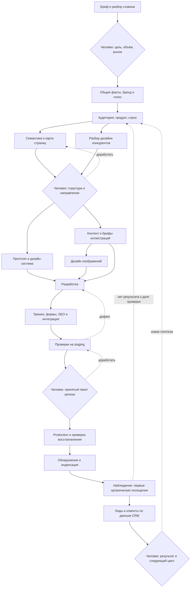

# Проект агентства: отделы, знания, передачи и точки решения

Версия 0.3, 2026-09-14. Это рекомендуемый контракт для новых проектов и карта соответствия для существующих. Пустые папки заранее не создавать, старые файлы автоматически не переносить. Структура проекта клиента не является структурой самого BB-сервис.

Определение PROJECT.md, случаи его создания и обновления — [жизненный цикл паспорта](project-passport.md). Для разового чата сначала принять свободное описание; файловые привязки нужны при переходе к сохраняемой работе.

## Два уровня и единая точка входа

**Направление отвечает, где искать материалы; задача — кто, зачем и на какой версии их меняет.** Работа начинается с `PROJECT.md` и `project.json` указанного клиентского проекта. Если проект/root не заданы, оставить их unknown в черновике; не выбирать клиентский проект по прошлой переписке или случайно найденным файлам. Общие знания и результаты живут в папках направлений; `work/tasks/<id>/` хранит карточку исполнения, происхождение, проверки и ссылки на результаты. Готовый баннер не дублируется в двух final-папках.

```text
<client-project>/
  PROJECT.md                         # карта проекта, текущая цель, навигация
  project.json                       # roots, knowledge_refs, systems, existing_contracts
  brand/
    BRAND.md                         # обещание, позиционирование, ограничения бренда
    VOICE.md                         # голос бренда с примерами и антипримерами
    assets/                          # утверждённые логотипы, шрифты, исходники
  product/
    PRODUCT.md                       # факты, услуги, цены по ссылке на первичную систему
    offers/<offer-id>/OFFER.md        # предложение и доказательства
  research/
    audience/AUDIENCE.md              # сегменты, ситуации, критерии выбора
    audience/PAINS.md                 # боли/страхи/возражения → ID свидетельств
    audience/LANGUAGE.md              # язык аудитории, короткие цитаты → источники
    market/MARKET.md                  # рынок и критерии выбора конкурентов
  calls/<YYYY-MM-DD>-<call-id>/
    recording.ref.json               # ссылка на оригинал, без лишней копии медиа
    transcript.md                    # таймкоды и участники
    decisions.md                     # решения, открытые вопросы, task IDs
  marketing/
    STRATEGY.md
    seo/
      research/                      # запросы, интенты, SERP, источники
      architecture/                  # страницы, связи, canonical intent
      briefs/<page-id>/BRIEF.md       # задача страницы, факты, SEO-критерии
      monitoring/<period>/           # индексация, поисковые показатели
    facebook/campaigns/<campaign-id>/
      BRIEF.md                       # рынок, оффер, бюджет, KPI, плейсменты
      hypotheses.json                # сегмент × сообщение × креатив
      copy/                          # версии объявлений
      creative-requests/             # ссылки на design request IDs
      releases/                      # принятый пакет, platform IDs, UTM
      reports/                       # показатели + даты + источники
    google-ads/campaigns/<id>/        # отдельная рекламная площадка
    yandex-direct/campaigns/<id>/
    social/<channel>/                # редакционный план, посты, отчёты
    crm/                             # сегменты, письма, сценарии
  content/
    PLAN.md
    articles/<article-id>/
      BRIEF.md                       # читатель, смысл, факты, критерии
      drafts/<version>/article.md
      visual-plan.json               # slot ID → место → request ID → asset ID
      release.json                   # принятый текст, картинки, URL публикации
    pages/<page-id>/                  # тексты посадочных и интерфейса
  design/
    research/competitors/<competitor-id>/
      DESIGN.md                      # URL/дата/рынок/наблюдения/выводы/ограничения
      evidence/                      # скриншоты с viewport и ссылками
    research/COMPARISON.md            # сравнение, уроки, запрет прямого копирования
    direction/DIRECTION.md            # принятое визуальное направление
    system/DESIGN.md                  # типографика, цвета, компоненты, состояния
    requests/<request-id>/BRIEF.md    # единое ТЗ дизайнеру, ссылки на задачу и потребителя
    assets/<asset-id>/<version>/      # исходник, экспорт, asset.json
  development/
    ARCHITECTURE.md
    repo.ref.json                    # код в настоящем репозитории, не его копия
    releases/<release-id>/            # commit, preview, checks, rollback, deployment URL
  analytics/
    MEASUREMENT.md                   # события, каналы, критерий лида/клиента
    events.json
    reports/<period>/
  operations/                        # эксплуатация, доступы по ссылкам, runbooks
  commerce/                          # товарные данные, фиды и ссылки на первичную систему
  media/                             # индекс; Reels/Insights сохраняют прежние контракты
  work/
    tasks/<task-id>/                  # task.json, sources.json, raw/, runs/, checks/, handoff
    journeys/<journey-id>/            # graph.json, dependency revisions, decisions/
    PROJECT-INDEX.json               # ссылки на задачи/артефакты; не вторая доска Tasks
```

Facebook и Instagram Ads через Meta используют `marketing/facebook/`; органический Instagram — `marketing/social/instagram/`. Если площадка ещё неизвестна, агент отмечает незаполненное назначение, не создаёт выдуманную кампанию. `project.json` может привязать логический `brand.voice` к существующему файлу в иной папке. Правило поиска: manifest → принятая ссылка → раздел направления → ограниченный поиск файлов → точный пробел. Прочитать всё дерево или всю историю чатов не требуется.

## Общие знания и версии

`knowledge_refs` задаёт для каждого ключа path, owner_role, status, version, source_ids, reviewed_at, review_after и applicability (рынок, язык, продукт). Например `audience.pains → research/audience/PAINS.md`, `brand.voice → brand/VOICE.md`, `design.system → design/system/DESIGN.md`. Общая утверждённая версия и локальная гипотеза кампании различаются. Наличие файла не равно его актуальности или принятию.

Перед задачей агент получает `context_requirements`: ключ, точный путь/версия, зачем нужен, достаточность. Отсутствующий документ создаёт зависимую задачу владельцу знания; можно продолжать независимые операции. Десять агентов не создают десять AUDIENCE.md. Один владелец обновляет общий файл; остальные предлагают изменения через task/patch. Новая принятая версия помечает зависимые результаты `needs_review`, но не запускает вечную переработку и не отменяет готовый релиз без оценки влияния.

Если слово клиента в созвоне изменило цену, транскрипт остаётся доказательством, а принятый продуктовый факт обновляется в PRODUCT/OFFER владельцем. Копирайтер читает новый факт, не ищет его заново среди всех звонков.

## Статья: текст, визуальный план и краткие ТЗ

Копирайтер отвечает за весь смысловой пакет: текст статьи, `visual-plan.json` и `visual-briefs.md`. Число картинок — редакторское решение от 0 до N, а не постоянная квота, норма конкурентов или одна картинка на заголовок. Источники решения: задача читателя, фактическая SERP для выбранного рынка/запроса, разбор релевантных материалов, сложность объяснения, доступные доказательства, принятый дизайн и ограничения публикации. SERP и конкуренты дают наблюдения; отсутствие данных не скрывать, необходимость иллюстрации можно обосновать редакторской логикой.

1. Копирайтер читает бриф, исследование, бренд и шаблон статьи; сохраняет источники в `content/articles/<id>/research/`. Определяет структуру, затем готовит текст и визуальный план совместно. Фото, схема, диаграмма, скриншот, таблица или отсутствие визуала выбираются по пользе читателю. Таблица не обязана быть растровой картинкой.
2. Для каждого предложенного слота записывает ID, точный anchor (section ID + before/after paragraph ID), цель, тезис, основание со ссылкой на evidence либо `editorial_judgment`, краткое ТЗ (что показать, подписи, что исключить, источник/способ создания), desktop и mobile поведение. Desktop: слева/справа/центр/на всю ширину, доля колонки, wrap=none/left/right. Mobile: порядок относительно текста, ширина, wrap и допустимый crop по шаблону. Обтекание — обоснованный выбор; на узком экране проверять порядок чтения и удобство, а не молча переносить desktop.
3. Редактор принимает текст и визуальный план вместе. Для простой задачи копирайтер может принять своё решение после отдельного прохода проверки, если в брифе выбран `review_mode=self`. Указать реального принимающего и режим; независимого проверяющего не имитировать. При высоком риске фактов/новом визуальном решении назначается независимый review. Человек участвует при решении, которое оставлено ему брифом/полномочиями; новые согласования для каждого абзаца не требуются.
4. После принятия копирайтер создаёт `design/requests/<request-id>/BRIEF.md` со ссылкой на канонические краткие ТЗ и выбранные slot IDs. Связь: `article_id + revision/hash → visual-plan revision → slot_id → request_id → asset_id/version`. Исходный полный бриф не размножать. Дизайнер уточняет технику и размеры, а существенные изменения смысла/числа/расположения возвращает на review плана.
5. Дизайнер создаёт/подбирает принятые визуалы и `design/assets/<asset-id>/<version>/asset.json`; копирайтер проверяет смысл, проверяющий — читаемость и соответствие ТЗ. Данные диаграммы, подлинный скриншот и фото товара не заменяются придуманным изображением. Источник и права сохраняются.
6. Верстальщик/CMS-исполнитель собирает статью по принятому плану. Редактор проверяет готовый preview на desktop/mobile: расположение, обтекание, порядок чтения, подписи, alt, реальный crop, размеры, ссылки и CTA. Принятый пакет фиксируется в `release.json`; публикация выполняется по имеющимся полномочиям.
7. Если визуалы не нужны: `decision=not_required`, `slots=[]`, причина и запись review. Дизайн-задачи не создавать, этапы подготовки изображений отмечаются skipped/not_applicable; текст идёт сразу в вёрстку и финальное ревью. При изменении текста оценить затронутые тезисы/anchors и обновить только зависимые слоты; старое одобрение не покрывает материальную правку.

Два изображения допустимы как вывод для конкретной статьи, но не закреплены в маршруте. Шаблоны: `assets/visual-plan.example.json`, `assets/design-brief.example.md`.

## Передача: Facebook-реклама

Аккаунт/стратег читает PRODUCT/OFFER, BRAND/VOICE, AUDIENCE/PAINS/LANGUAGE и MEASUREMENT; составляет `marketing/facebook/campaigns/<id>/BRIEF.md`. Неизвестный бюджет — вопрос владельцу, не угаданное число. Копирайтер формирует copy по матрице гипотез; дизайнер получает requests со ссылками на эту версию copy и плейсменты. Проверяющий сверяет обещания, посадочную, размеры и актуальные ограничения площадки по доступной документации. Пакет запуска связывает принятые copy/assets/landing URL, бюджет, даты, кабинет. Предварительно данное полномочие запуска можно использовать в его пределах, не спрашивая повторно. Если его нет — человек принимает конкретный пакет. Метрики идут в reports, выводы — в hypotheses новой версии; новые боли аудитории предлагаются владельцу исследования как гипотезы, не сразу как факты.

## Дизайн-бриф и пять конкурентов

Для нового сайта/ребрендинга перед выбором направления нужен принятый разбор обычно пяти релевантных конкурентов. В каждом DESIGN.md: рынок/сегмент, почему конкурент, URL и дата, desktop/mobile evidence, навигация и ключевой сценарий, композиция/типографика/цвет, доказательства и CTA, состояния/доступность, сильные стороны и проблемы, применимые принципы. Отделять наблюдение от гипотезы влияния на конверсию; не выдумывать чужие метрики.

Gate проверяет число реальных разборов, релевантность рынку, наличие доказательств, сравнительную сводку и связь решений с задачей бренда. Если релевантных сайтов три — представить причину и согласовать достаточный охват; не создавать два фиктивных. `waiver` хранит решение человека и причину. Уже принятая актуальная подборка используется повторно. Для ресайза, картинки к статье или баннера по принятой системе gate не применяется: достаточно брифа и design system.

## Роли и навыки

Роль задаёт ответственность, модель — исполнителя, skill — процедуру, инструмент — действие. Поручать не «все навыки дизайнеру», а 1–3 относящихся к этапу. Каталог — кандидаты, наличие в списке не гарантирует доступ инструментов. Перед исполнением прочитать выбранный SKILL.md и проверить capabilities.

| Роль/этап | Skills по условию | Приёмка |
|---|---|---|
| Оркестратор | model-task-prompts; app-architect для приложения; tasks при BB Tasks; workflows только для исполнения workflow | Полные зависимости, владелец входа/результата, решения человека |
| Исследователь аудитории | social-insights для соцкорпуса; text-insights для переданных текстов; reddit-mapper для форумов | ID доказательств, покрытие, наблюдения отдельно от выводов |
| SEO-архитектор | cocoon-pilot/TGA для структуры, gist-content-logic для брифа; Google/Яндекс-навык нужного сервиса | Спрос, интенты, страницы и происхождение метрик |
| Копирайтер | copywriter для сайта; ru-text для русского; ru-check для вычитки; ru-score только при оценке | Текст, обоснованный визуальный план и краткие ТЗ |
| Редактор | gist-content-logic для полезности, ru-check для текста; ui-review для собранной страницы | Приёмка текста/плана и preview; выбранный review_mode |
| Дизайнер UX/UI | ui-review для анализа; page-prototype для wireframe; imagegen/Canva — по виду артефакта | Ключевой сценарий, состояния, визуальный просмотр |
| Дизайнер статьи | imagegen либо подходящий Canva skill; чтение BRIEF и brand/design refs | Все принятые слоты соответствуют тезисам, форматам и версии статьи |
| Программист | профильный skill только если есть; browser-automation для UI; инструкции repo | Сценарий, diff, релевантные тесты, preview |
| Аналитик | google-analytics / yandex-metrica / google-search-console / yandex-webmaster по данным | Числа воспроизводимы, определения и периоды согласованы |
| Рекламный специалист | copywriter/ru-text для текста, google-ads/Direct только для своей площадки | Точные ограничения, бюджет и посадочная; для Meta нет подтверждённого специального skill в текущем каталоге |

UI/UX Pro Max был найден в сохранённой копии, не установлен как общий навык; не делать его безусловной зависимостью. Специальный skill дизайн-брифа не заявлен как существующий: контракт брифа и проверка исследования даны здесь, ui-review решает только свою часть.

## Gates и цикл доработки

Gate = тип, владелец решения, входные версии, критерии, пакет доказательств, исход и обратный маршрут. Типы: `input` (хватает ли данных), `quality` (проверка результата), `human` (выбор/приёмка/разрешение), `outcome` (наблюдаемое событие бизнеса). Условия конкретного заказа могут убрать несущественный gate или использовать уже данное решение. Срок молчания не является одобрением.

Человеку показывается готовый review-pack.md: результат/preview, версия, критерии с доказательствами, варианты решения и последствия, один конкретный вопрос. Исходы: approved, changes_requested, needs_answer, waived с причиной. Запись решения содержит actor, timestamp, decision_ref, subject_version. Компилятор проверяет наличие полей; подлинность и полномочия подтверждает среда исполнения, не произвольный JSON от модели.

Возврат идёт владельцу дефекта; после новой версии повторяются затронутые проверки. Подтверждение старой версии не покрывает материально изменённый предмет. Не более двух циклов одинакового провала без смены гипотезы; затем оркестратор разбирает причину и привлекает человека при нужном решении. Очередь не должна расходовать подписки в ожидании индексации или ответа: задать next_check_at и событие возобновления, не запустить бесконечный агентский цикл.

## Сайт → production → SEO-посетители → клиенты



Входы, результаты, роли, навыки, gates и точные обратные связи каждого узла — в `assets/agency-operating-model.json` и интерактивной схеме. Разделять три приёмки: технический запуск (команда контролирует), наблюдаемый органический трафик (внешний результат), реальный клиент (выигранная сделка или оплата по принятому правилу бизнеса). Лид не равен посетителю, и посетитель не равен покупателю.

Первый органический визит: за согласованный период есть положительные данные выбранного источника аналитики с organic channel, определёнными фильтрами и учётом тестовых посещений; GSC clicks — отдельное подтверждение поисковых переходов, не равенство числу сессий. Первый SEO-клиент: CRM-сделка/оплата с принятой моделью атрибуции; если связки нет, attribution=unknown, не догадка. Целевые значения и период принимает владелец; шаблон их не выдумывает.

Google предупреждает, что обход занимает время и запрос индексации не гарантирует попадание в выдачу: [индексация](https://developers.google.com/search/docs/crawling-indexing/ask-google-to-recrawl). Клики Search Console и сессии Analytics имеют разные определения: [совместный анализ](https://developers.google.com/search/docs/monitor-debug/google-analytics-search-console). Поэтому production, indexed, organic_traffic_observed и customer_observed — разные статусы; бизнес-этап не помечается done по факту деплоя.

## Каталог конечных результатов

В assets/agency-operating-model.json: 80 результатов в 16 группах, 17 основных процессов и индивидуальные маршруты результатов. Сначала выбрать конечный пакет по outcomes, затем открыть journey_id. Для необычного заказа использовать custom-outcome и сформировать конкретные зависимости. source_ids связывают сценарий с описанием похожей практики, а не доказывают готовность нашего runtime или прибыльность.

## Метаданные рабочих документов

Стандарт agency-artifacts: MD начинается YAML front matter, JSON содержит _meta. Поля связывают проект, отдел, задачу, владельца, статус документа и версию. Приёмка документа не завершает задачу автоматически. Raw, JSONL и закрытые схемы сохраняются через sidecar/родной manifest; SKILL.md имеет собственный контракт. Нужный навык выбирается только при создании сохраняемого документа.
